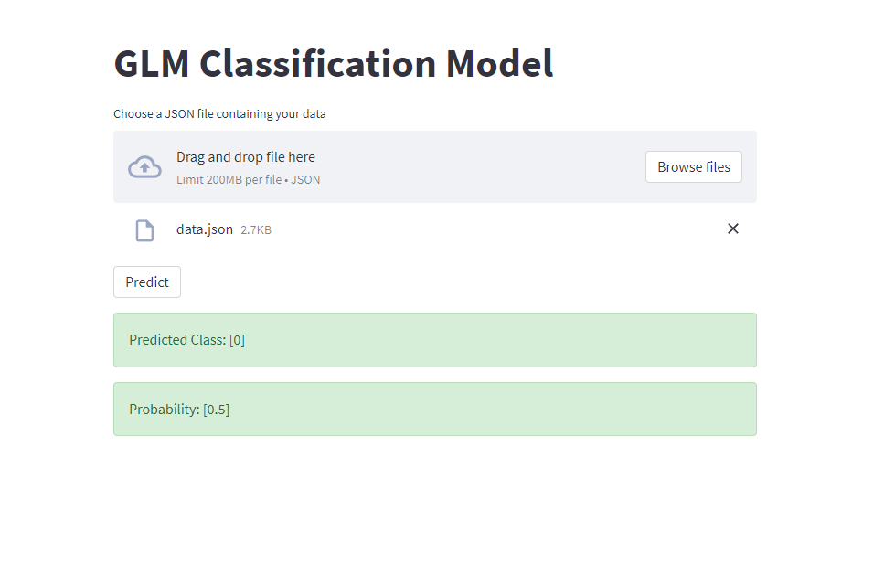

# sf-project
This project is an assessment for an open SF role.

### Project Overview
This project provides a FastAPI-based prediction model API and a Streamlit UI for user interaction. Users can upload JSON files containing data for prediction, and the results are returned by the API and displayed on the Streamlit UI.

### Features
FastAPI
Streamlit
Data Preprocessing: Includes data cleaning, imputation, scaling, and dummy variable creation.
Model Prediction: Uses a trained model to classify input data.

### Accessing the Application
The FastAPI server will be available at:
http://localhost:1313

The Streamlit UI will be available at:
http://localhost:8501

### Usage
Open the Streamlit URL.
Upload a JSON file containing your data.
Click the "Predict" button to send the data to the FastAPI server and get the results.

Alternatively, just send requests to the FastAPI server.

### Streamlit UI example
